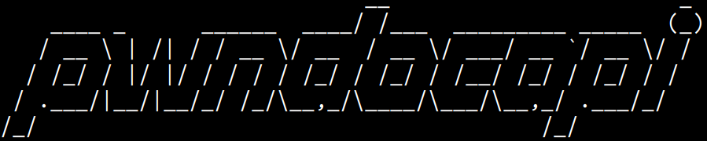

<p align="center">
    A python library to interact with Pwndoc instances for pentest reports generation.
    <br>
    <a href="https://twitter.com/intent/follow?screen_name=podalirius_" title="Follow"></a>
    <a href="https://www.youtube.com/c/Podalirius_?sub_confirmation=1" title="Subscribe"></a>
    <br>
</p>

## Features
- [x] Connect to a remote pwndoc instance.
- [x] Manages the audits (create, delete, list audits).
- [x] Add new findings to your audit.

## Examples of usage

### Create a new audit

```py
import pwndocapi

p = pwndocapi.pwndoc("192.168.1.19", 8443, verbose=True)
p.login("username", "password")
# Create a new audit
audit = p.audits.create("PoC Audit", "fr", "TI Externe")
print("audit:", audit)
```

## Contributing

Pull requests are welcome. Feel free to open an issue if you want to add other features.
